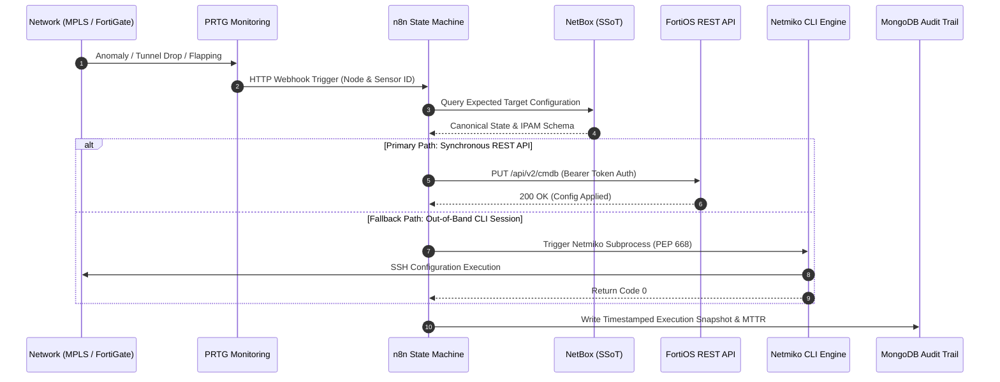

# NetDevOps Closed-Loop Active Self-Healing Platform

<p align="left">
  
  
  
  
  
  
  
  
  
  
</p>

> **Enterprise Hybrid Network Auto-Remediation (In collaboration with ARTE, I.P.)**  
> Active self-healing orchestration for hybrid corporate networks (Underlay MPLS + Overlay IPsec FortiGate VPN), reducing incident response and recovery times from **15–30 minutes to deterministic 4–7 seconds**.

---

## 🛠️ Tech Stack

* **Orchestration & Workflow Engine:** `n8n` (State Machine with event-driven execution)
* **Single Source of Truth (SSoT):** `NetBox` (IPAM / DCIM context reconciliation)
* **Target Network Hardware & API:** `Fortinet FortiGate (FortiOS 7.x REST API CMDB)`
* **Contingency Execution:** `Python 3.11` + `Netmiko` (Out-of-band SSH engine under PEP 668 compliance)
* **Monitoring & Triggers:** `PRTG Network Monitor` (Automated webhook payloads)
* **Data Persistence & Audit:** `MongoDB` (Immutable event ledger & timing metrics)
* **Analytics & Telemetry:** `Metabase` (Real-time MTTR visualization & SLA reporting)
* **Infrastructure Packaging:** `Docker` & `Docker Compose`

---

## 🔥 Key Highlights & What Was Built

* 🔄 **Event-Driven Closed-Loop Orchestration:** Autonomous detection via PRTG webhooks triggering deterministic state machines in n8n.
* 📖 **Single Source of Truth (SSoT):** Runtime network state validation and configuration drift prevention against NetBox IPAM/DCIM.
* ⚡ **Synchronous Remediation:** Direct CMDB patch operations via FortiOS REST API secured with token-based authentication and trusted host restrictions.
* 🛡️ **Out-of-Band Fallback Engine:** Resilient CLI contingency engine written in Python (Netmiko) running in isolated virtual environments under PEP 668 to bypass API write-license constraints.
* 🧪 **Chaos Engineering Audits:** 24 fault-injection scenarios systematically tested (link drops, BGP flaps, API timeouts), achieving 100% automated recovery.
* 📊 **Telemetry & Audit Trail:** Real-time MTTR calculations in Metabase with immutable incident logs stored in MongoDB.

---

## 🏛️ Architecture & Closed-Loop Workflow

```text
[ PRTG Webhook Alert ]
       │
       ▼
[ n8n State Machine ] ◄── (ICMP Pre-Check: Underlay vs Overlay)
       │
       ├──► [ NetBox SSoT ] (Query expected IPAM / Config Context)
       │
       ▼
[ Hybrid Execution Engine ]
       ├── 1. Primary: FortiOS REST API (Synchronous CMDB Patch)
       └── 2. Fallback: Python 3.11 / Netmiko via SSH (PEP 668)
       │
       ▼
[ Observability & Telemetry ]
       ├── Audit Trail & Incident Logs ➔ MongoDB
       ├── KPI & MTTR Visualizations   ➔ Metabase Dashboards
       └── Incident Notifications     ➔ Telegram / Alert Channels
```

### Sequence Flow (Mermaid)



---

## 🔬 Chaos Engineering Matrix & MTTR Benchmarks

A full suite of **24 Chaos Engineering scenarios** was executed to validate system determinism under adverse network conditions:

| Domain | Injected Fault Example | Remediation Strategy | Manual Baseline | Auto MTTR | Delta |
|:---|:---|:---|:---|:---|:---|
| **Overlay IPsec** | Phase 2 SA abrupt tear-down | Automated IKE SA renegotiation | ~18 min | **4.2 s** | `-99.6%` |
| **Underlay Routing** | BGP peer flap damping penalty | Route un-dampen & neighbor clear | ~20 min | **5.8 s** | `-99.5%` |
| **API Failure** | Firewall drop on REST port 8443 | Automatic trigger of Netmiko CLI | ~15 min | **6.9 s** | `-99.2%` |
| **SSoT Drift** | Unauthorized VLAN / IP drift | Force reconcile from NetBox SSoT | ~30 min | **5.1 s** | `-99.7%` |

👉 *Full scenario catalog available in [docs/chaos_scenarios.md](docs/chaos_scenarios.md).*

---

## 🚀 Getting Started

### Prerequisites
* Docker & Docker Compose
* Python 3.11+
* Network access to FortiGate (virtual or physical) & NetBox instance

### Setup & Local Deployment

1. **Clone the repository:**
   ```bash
   git clone https://github.com/RafaCr3z/netdevops-closed-loop-platform.git
   cd netdevops-closed-loop-platform
   ```

2. **Environment configuration:**
   ```bash
   cp .env.example .env
   # Populate .env with your FortiOS, NetBox, and Webhook tokens
   ```

3. **Spin up data & orchestration services:**
   ```bash
   docker compose up -d
   ```
   *Services initialized:*
   - **n8n Orchestrator:** `http://localhost:5678`
   - **Metabase Analytics:** `http://localhost:3000`
   - **MongoDB Ledger:** `localhost:27017`

4. **Install Python dependencies (PEP 668 compliant):**
   ```bash
   python3 -m venv .venv
   source .venv/bin/activate  # On Windows: .venv\Scripts\Activate.ps1
   pip install -r scripts/requirements.txt
   ```

5. **Execute Chaos Engineering Simulation:**
   ```bash
   python scripts/chaos_injector.py
   ```

---

## 📂 Repository Structure

```text
netdevops-closed-loop-platform/
│
├── .github/
│   └── workflows/
│       └── ci.yml                 # CI Pipeline: Flake8, Black, Syntax Validation
├── docker-compose.yml             # Containerized Stack (MongoDB, Metabase, n8n)
├── .env.example                   # Environment configuration template
├── .gitignore                     # Git ignore rules
├── LICENSE                        # MIT License
├── README.md                      # Project documentation
│
├── n8n/                           # Orchestration state machine exports
│   └── closed_loop_orchestration.json
│
├── scripts/                       # PEP 668 compliant automation scripts
│   ├── requirements.txt           # Python dependencies
│   ├── fortios_remediation.py     # Primary REST + Fallback Netmiko engine
│   └── chaos_injector.py          # 24-scenario Chaos Engineering runner
│
└── docs/                          # Architecture & test reports
    └── chaos_scenarios.md         # Detailed scenario matrix & benchmarks
```

---

## 👥 Authors & Acknowledgments

* **Rafael Cruz** — [LinkedIn](https://linkedin.com/in/rafael-cruz-7159092b2) | [GitHub](https://github.com/RafaCr3z)
* **Institutional Partner:** ARTE, I.P. (*Agência para a Reforma Tecnológica do Estado*)
* **Academic Supervisors:** Prof. Doutor Vasco Soares & Prof. Doutor Alexandre Fonte (*Instituto Politécnico de Castelo Branco - IPCB*)

---
<p align="center">
  <sub>Developed with engineering rigor for mission-critical network automation.</sub>
</p>
